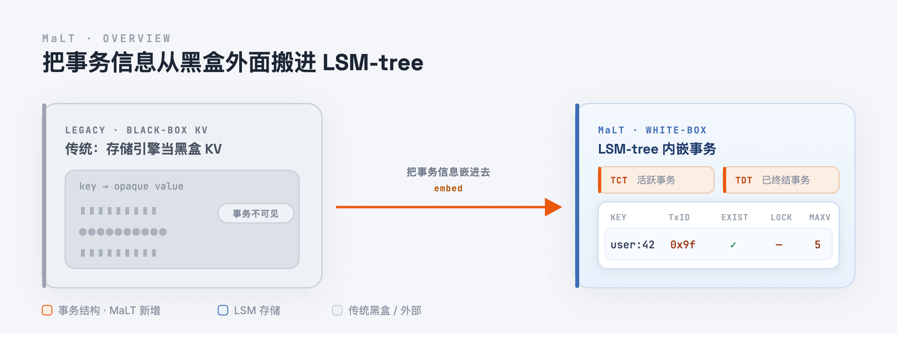
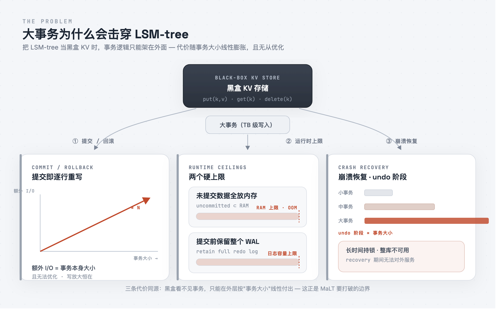
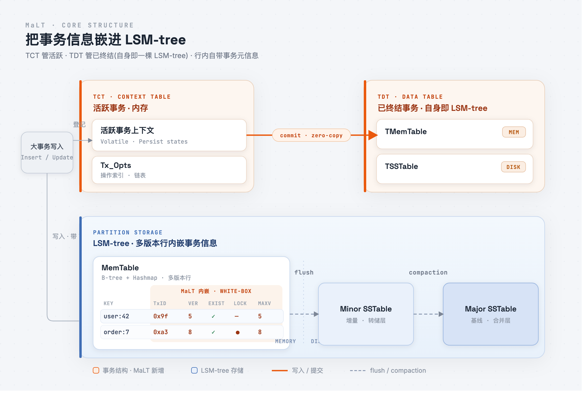
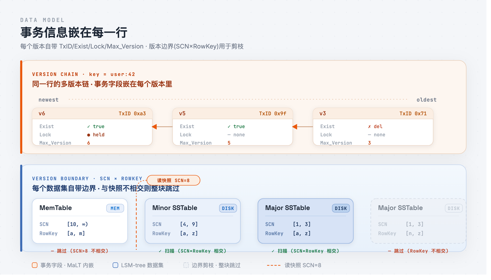
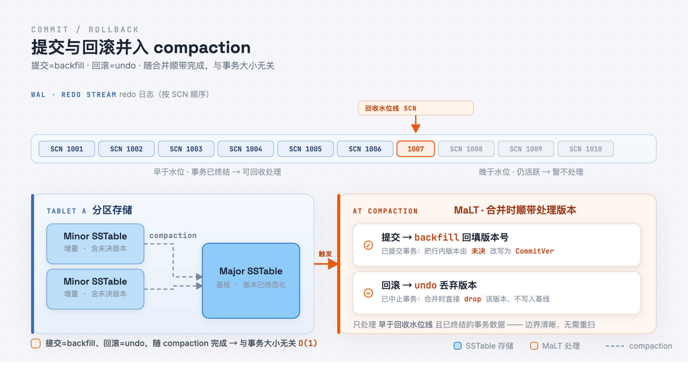
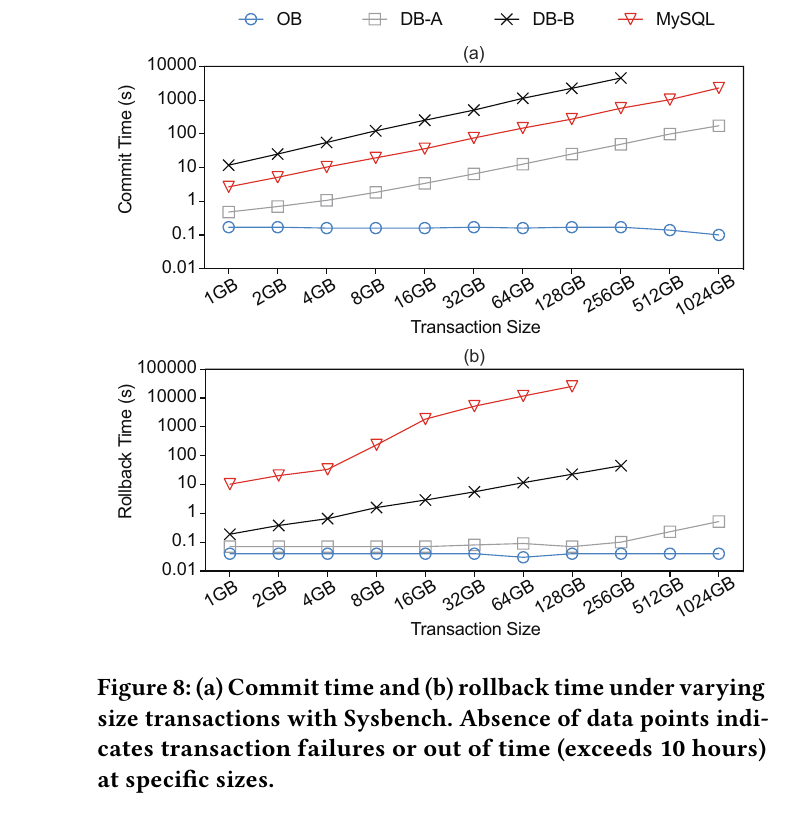
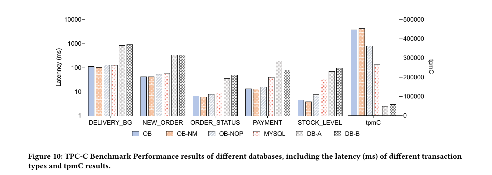

# 提交一个 1TB 的事务，和提交 1MB 一样快——MaLT 如何把大事务的提交/回滚/恢复做成常数时间

不管提交的是 1MB 还是 1TB 的事务，MaLT 的提交、回滚、恢复耗时几乎不变。一次 250 万行的批量数据导入，端到端耗时从 11778 秒降到 8966 秒，快了 23.9%。

这两个数字来自同一个改动：MaLT 不再把存储引擎当成一个黑盒的 key-value 存储，而是把事务信息直接嵌进 LSM-tree 内部。它出自 OceanBase 团队，发表于 SIGMOD 2025，是第一个在 LSM-tree 上直接管理大事务、而非把它抽象成 KV 读写的方案，目前用在 OceanBase 4.x 的生产环境、服务上千家客户。

这篇文章只讲一件事：把事务状态从存储引擎外部搬进 LSM-tree 内部，会怎样改变提交、回滚、恢复和日常读写。先从问题开始——为什么一个大事务会拖垮基于 LSM-tree 的数据库。

---

## 问题背景：为什么大事务会拖垮 LSM-tree

先界定"大事务"。不是几十行的转账，而是单次几十万到几百万行的批量写入：金融系统的日终跑批、数据导入，一次提交 250 万行，数据量从几百 GB 到 1TB。它们的共同点是未提交数据量远超内存。

LSM-tree 对这种负载尤其脆弱。它的写入路径是：数据先进内存的 MemTable，攒够后 flush 成磁盘上不可变的 SSTable。事务提交前，这些改动处于未提交状态——既不能对其他事务可见，又必须随时能回滚。如何存放这批未提交数据，现有 LSM 系统有两种做法，各有一个上限：

1. **全放内存**（采用 Percolator 模型的一类系统）：实现简单，但事务大小受内存限制，超过即 OOM。
2. **允许落盘**（RocksDB 的 steal 策略）：未提交数据可以写盘，代价是提交前必须保留整个 WAL 不能回收，于是事务大小受日志容量限制。

第二个问题是崩溃恢复。ARIES 式恢复分 redo 和 undo 两阶段，undo 的耗时与未完成事务的大小成正比：事务越大，要回滚的操作越多，期间相关行锁一直持有，数据库对外不可用。一个未提交完就宕机的 1TB 事务，可以让数据库停摆数小时。

这些问题来自同一个根源。**核心矛盾在于：大多数基于 LSM-tree 的数据库把存储引擎当成黑盒 key-value 存储。** 在这层抽象下，提交一个事务意味着把它改过的每一行重写一遍、把版本号更新为提交版本（backfill），回滚则要把它们覆盖回去（undo）；而 SSTable 不可变，这些重写只能作为新的 KV 追加。结果是：**提交和回滚的额外 I/O 恰好等于事务本身的大小，而且因为引擎看不到事务语义，这部分开销无法优化。**

MaLT 要解决的，就是拆掉这层黑盒。

## 核心洞察：把事务信息放进 LSM-tree

拆掉黑盒，就是不再把 LSM-tree 当成只认 key 和 value 的存储层，而是让它理解事务。MaLT 分两步做这件事：给 LSM-tree 配两张事务表，再把事务信息嵌进每一行。

先看两张表。

**TCT（Transaction Context Table）管活跃事务。** 每个执行中的事务，上下文都记录在 TCT 里：事务状态、提交版本，以及一个叫 Tx_Opts 的操作索引——按执行顺序记下该事务改过哪些行。TCT 常驻内存，只在 checkpoint 时按 LSM-tree 的 flush 流程落盘一次，正常运行不访问磁盘。

**TDT（Transaction Data Table）管已终结事务。** 事务一旦提交或中止，其事务数据从 TCT 移交 TDT。关键之处是 **TDT 本身就是一棵 LSM-tree**（内存的 TMemTable + 磁盘的 TSSTable），因此它继承了 LSM-tree 的两个特性：顺序写入，以及由后台 compaction 周期性回收过期数据。事务数据在 TCT 和 TDT 之间 zero-copy 移交——不复制数据，只转移引用。

仅这两张表就解决了"未提交数据放不下"的问题：未提交改动不必全留内存（TCT 只存上下文），也不必锁住 WAL；行数据落在 LSM-tree 里，状态由 TCT/TDT 在外部追踪。事务大小不再受内存或日志限制。

第二步是把事务信息嵌进每一行。LSM-tree 本就是多版本的（每行带 TxID 和版本号；这个全局递增的提交版本号，OceanBase 里叫 SCN，下文沿用），MaLT 在此基础上给每行再加三个字段：

- **Exist**：该行是否存在（区分插入与删除）；
- **Lock**：该行是否被某事务持有行锁；
- **Max_Version**：该行已提交的最大版本号。

这三个字段让并发控制在内存里就能完成：主键冲突查 Exist，行锁冲突查 Lock，丢失更新查 Max_Version，都不需要回磁盘读原始行。

整个设计就一句话：**把事务状态和事务信息，从存储引擎外部搬进 LSM-tree 内部、嵌进行里。** 下面用一笔具体事务，看它如何改变提交、回滚、恢复和读写。

## 把事务搬进 LSM-tree 之后

把事务状态放进 LSM-tree 不是一个孤立的优化，它会沿着提交、回滚、恢复、读写一路传导。下面分三条看它在每条路径上的结果。为具体起见，跟一笔事务 T：它把 `user:42` 从 v5 改到 v6，同时插入几十万行新数据。

### 提交和回滚是常数时间

T 执行时，改动以未提交版本写入 MemTable，每个版本带 T 的 TxID；TCT 记录 T 的上下文，Tx_Opts 按顺序记下它改过的行。

提交时，把 LSM-tree 当 KV 存储的系统必须把这几十万行逐行重写，将版本号改成提交版本（backfill），开销与事务大小成正比。MaLT 不重写。它在 TCT 中把 T 标记为已提交、记下提交 SCN，把事务数据移交 TDT，提交即完成。未提交版本留在原处，由 compaction 处理：合并各层数据时，对每个未提交版本查一次它所属事务在 TDT 中的状态——已提交则回填版本号，已中止则丢弃。WAL 上维护一条回收水位线（一个 SCN），compaction 只处理早于它、已终结的事务数据，处理后回收。

回滚走同一条路径：中止只改 TDT 中的状态，未提交版本同样等下一次 compaction 清除。提交和回滚因此与事务大小无关——T 改了 1MB 还是 1TB，这一步都只是改几个状态、移交一次引用。

改动量不超过阈值的小事务走另一条路：直接用 Tx_Opts 在 MemTable 中就地 backfill/undo，不涉及 TDT 和 compaction。

这一步成立的前提，是 LSM-tree 现在能区分哪些版本属于哪个事务、那个事务是否已终结。黑盒 KV 没有这个信息，只能在提交时一次付清重写开销。

### 恢复不需要 undo

假设 T 还没提交完，数据库就宕机了。ARIES 恢复要跑 redo 和 undo，undo 负责逐行抹掉 T 的未提交改动，耗时与 T 的大小成正比——这是大事务恢复慢的根源。

MaLT 不跑 undo。redo 照常：先用 checkpoint 持久化的 TCT 恢复事务上下文，再从 checkpoint 之后重放日志。日志是物理逻辑日志、每行带 SCN，重放可以乱序并行——重放某条记录时，比较它的 SCN 和目标行当前版本的 SCN，决定是否应用，不必严格按序。redo 结束，所有活跃事务（含 T）回到宕机前的状态。

undo 被整个省去。未提交版本不需要在恢复时清理：之后读到它们时，查一次 TDT 中对应事务的状态，已中止就跳过该版本。回滚清理同样推迟到后续 compaction。恢复耗时因此与事务大小无关——状态在 TDT 中可见，读取时即可判定，不需要停下来逐行 undo、并在此期间持有锁。

### 读写路径少一次磁盘访问

前两条是大事务的常数时间，这一条针对所有事务。事务信息嵌在数据里之后，读和写各省掉一次磁盘 I/O。

读：MemTable 和每个 SSTable 都带版本边界——一段 SCN 范围和一段 RowKey 范围。一次带快照版本的读，先用边界与之相交的数据集确定下界，再取数据；边界不相交的整块跳过，不必读进去才发现没有目标版本。为进一步降低读取事务数据本身的开销，MaLT 给 TDT 加了两级的事务数据缓存（TxDataCache）：query 级的小缓存（几条记录、列表结构）应对一次查询内对同一事务数据的重复读，LRU 大缓存应对跨查询的热点。

写：主键冲突、行锁、丢失更新这三种检测，传统上都要把对应行从磁盘读出来确认。MaLT 直接查行内的 Exist、Lock、Max_Version，这些写路径不再访问磁盘。

在 TPC-C 上，开启这些优化的 MaLT 比把 LSM-tree 当黑盒 KV 的版本（OB-NOP）tpmC 高约 23%、平均延迟低约 22%。

## 性能

测试机器是 64 核 Intel Xeon Platinum 8369B、400GB 内存。对照组包括 OceanBase 本体（OB）、去掉 MaLT 的 OB-NM、去掉读写优化并把 LSM-tree 当纯 KV 用的 OB-NOP，以及 MySQL 8.0、两个商业分布式数据库 DB-A 和 DB-B。评测主要在单机进行，以隔离存储层、排除网络等分布式因素。

**大事务导入。** 模拟金融批量导入，端到端耗时从 11778.4 秒降到 8966.0 秒，快 23.9%。

**提交与回滚。** 用 Sysbench 把单个事务从 1GB 增到 1TB，分别测提交和回滚耗时。MaLT 两条曲线基本水平；其余系统随事务增大而上升。MySQL 在 1TB 量级的回滚达到小时级，开销主要来自逐页 undo 和 binlog 同步；DB-B 在事务超过 50GB 后报错失败；DB-A 能完成，但处理大事务效率很低，因为它要实际重写数据。

吞吐结论一致：10 线程并发、事务从 512MB 到 500GB，MaLT 在各尺寸上的 TPS 最高。

**崩溃恢复。** 用 20GB 到 200GB 的事务测异常宕机后"数据库恢复可用"的时间。MaLT 稳定在 23–25 秒，几乎不随事务大小变化；OB-NM 从 20GB 的 27 秒升到 200GB 的 175 秒。

**在线负载与开销。** 回到常规负载，TPC-C 上 MaLT 比 OB-NOP tpmC 高约 23%、平均延迟低约 22%。TDT 的空间开销不大：300 万事务占 0.3GB，3000 万事务占 3.09GB，且它本身是 LSM-tree，由 compaction 周期回收。读取事务数据的延迟由事务数据缓存降低，重复访问同一批事务数据时差距更明显。

消融对照（OB / OB-NOP / OB-NM）把每一层收益都对应回同一个改动：把事务信息放进 LSM-tree。各项收益不是一组独立优化的叠加。

## 局限与展望

把事务信息放进 LSM-tree 有代价。行内版本变多，回收依赖 compaction，调度不当会导致过期事务数据堆积；把 backfill/undo 并入 compaction，也改变了 compaction 的负担和触发时机。TDT 本身是一棵 LSM-tree，省空间，但仍是一份额外的空间放大。此外，常数时间主要针对大事务——对小而高并发的短事务，TCT/TDT 反而是额外开销，所以 MaLT 给阈值以下的小事务保留了走 Tx_Opts、不经事务表的路径。

分布式场景还有两个工程问题。两阶段提交的参与者列表可能很长，长到使日志膨胀，需要把一部分参与者信息放进 TCT 的执行信息中；follower 回放要跟上 leader，需要使用与 leader 相同的 Tx_Opts 索引以保持一致进度。

一个后续方向是把有限的事务信息直接 backfill 进 SSTable 的元数据，使读写优化不必等 compaction 落地即可生效，并把事务表从关键路径上移除。

不论如何，MaLT 把一件原本与事务大小强相关的成本变成了常数：无论 1MB 还是 1TB，提交、回滚、恢复的耗时基本一致。方法自始至终只有一句话——不要把存储引擎当黑盒，让 LSM-tree 理解事务。它已用于 OceanBase 4.x 的生产环境、服务上千家客户，源码在 OceanBase 的开源仓库。

> 论文：*MaLT: A Framework for Managing Large Transactions in OceanBase*（SIGMOD 2025）。源码：OceanBase GitHub。
